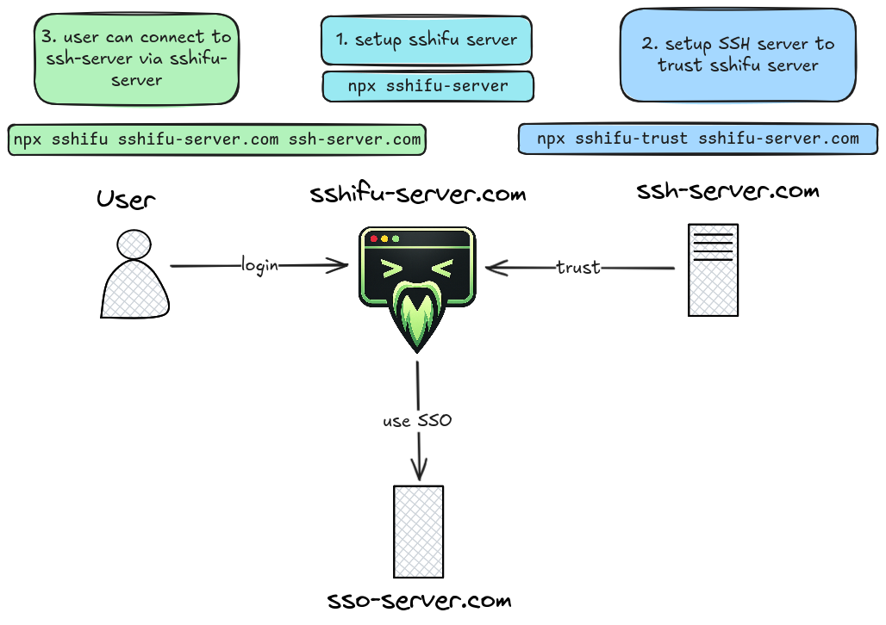
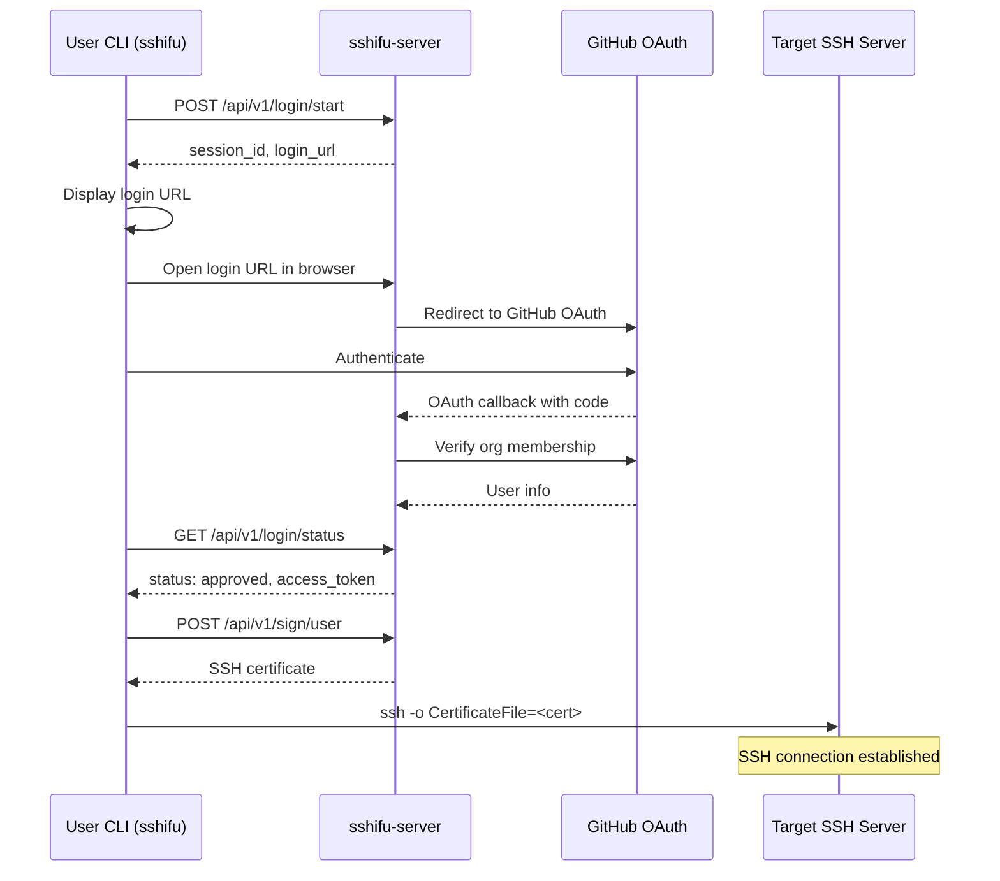

# Sshifu

<div align="center">
  
</div>

**Sshifu** (SSH + Fu / 師傅 "master") helps you log in to SSH with SSO.

It issues short-lived **OpenSSH certificates** after users authenticate with an OAuth provider (currently **GitHub Organizations**), so you can stop distributing and cleaning up long-lived public keys.

SSH access is ubiquitous, but managing `authorized_keys` at scale is painful:

- Getting access often means copying keys around by hand
- Offboarding is risky (keys get forgotten)
- Auditing who can access what is harder than it should be

SSO-based SSH access is a better model, but existing platforms like **Teleport** or **Smallstep** can be heavy and come with a steep learning curve.

Sshifu aims to be the minimal, OpenSSH-compatible alternative: a small server that acts as an OAuth gateway + SSH CA, plus two tiny CLIs to set up trust and connect.

## How Sshifu Works



The diagram above shows the three-step setup process:

1. **Setup sshifu server** - Start the sshifu-server (e.g., `npx sshifu-server`)
2. **Setup SSH server to trust sshifu server** - Configure trust on the target SSH server (e.g., `npx sshifu-trust sshifu-server.com`)
3. **User can connect to ssh-server via sshifu-server** - Authenticate and connect (e.g., `npx sshifu sshifu-server.com ssh-server.com`)

## Quick Start

```bash
# Expose your server publicly (here we're using localhost.run for testing)
ssh -R 80:localhost:8080 nokey@localhost.run

# Prepare GitHub OAuth credentials & note the localhost.run URL from above.
# In another terminal, start the sshifu server and follow the wizard.
npx sshifu-server

# On the SSH server machine, configure trust (requires sudo)
sudo npx sshifu-trust <localhost.run address>

# From another machine, connect to the SSH server
npx sshifu <localhost.run address> <ssh server address>
```

## Components

| Tool | Purpose |
|------|---------|
| `sshifu` | CLI used by users to authenticate and connect to SSH servers |
| `sshifu-server` | Web server acting as OAuth gateway and SSH Certificate Authority |
| `sshifu-trust` | Server-side CLI to configure SSH servers to trust the Sshifu CA |

## Installation Options

#### Option 1: Install Globally via npm

For frequent use, install globally:

```bash
npm install -g sshifu
```

Then use commands directly:

```bash
sshifu auth.example.com user@target-server.com
sshifu-server
sshifu-trust auth.example.com
```

#### Option 2: Pre-built Binary

Download the latest release for your platform from the [releases page](https://github.com/azophy/sshifu/releases):

```bash
# Linux (amd64)
curl -L https://github.com/azophy/sshifu/releases/latest/download/sshifu-linux-amd64.tar.gz | tar xz
sudo mv sshifu* /usr/local/bin/

# macOS (Intel)
curl -L https://github.com/azophy/sshifu/releases/latest/download/sshifu-darwin-amd64.tar.gz | tar xz
sudo mv sshifu* /usr/local/bin/

# macOS (Apple Silicon)
curl -L https://github.com/azophy/sshifu/releases/latest/download/sshifu-darwin-arm64.tar.gz | tar xz
sudo mv sshifu* /usr/local/bin/

# Windows (amd64)
curl -L https://github.com/azophy/sshifu/releases/latest/download/sshifu-windows-amd64.zip -o sshifu.zip
unzip sshifu.zip
# Move sshifu.exe to a directory in your PATH
```

#### Option 3: Build from Source

Requires Go 1.25+:

```bash
go build ./cmd/sshifu
go build ./cmd/sshifu-server
go build ./cmd/sshifu-trust
```

## Getting GitHub OAuth Client ID & Secret

To configure OAuth authentication with GitHub, you need to create a GitHub OAuth App:

1. Go to your GitHub organization's settings: `https://github.com/organizations/<your-org>/settings`
2. Navigate to **Developer settings** (left sidebar)
3. Click **OAuth Apps** → **New OAuth App**
4. Fill in the application details:
   - **Application name**: `sshifu` (or any descriptive name)
   - **Homepage URL**: Your sshifu-server public URL (e.g., `https://auth.example.com`)
   - **Authorization callback URL**: Same as your sshifu-server public URL (e.g., `https://auth.example.com`)
5. Click **Register application**
6. After registration, you'll see your **Client ID** - copy it
7. Click **Generate a new client secret** and copy the secret

> ⚠️ **Important**: The client secret is only shown once. Store it securely and never commit it to version control.

## Authentication Flow



## Configuration

### Server Configuration

| Field | Description | Default |
|-------|-------------|---------|
| `server.listen` | Address to listen on | `:8080` |
| `server.public_url` | Public URL of the server | Required |
| `ca.private_key` | Path to CA private key | `./ca` |
| `ca.public_key` | Path to CA public key | `./ca.pub` |
| `cert.ttl` | Certificate time-to-live | `8h` |
| `auth.providers` | OAuth provider configurations | Required |

### Certificate Extensions

By default, issued certificates include:
- `permit-pty` - Allow pseudo-terminal allocation
- `permit-port-forwarding` - Allow TCP port forwarding
- `permit-agent-forwarding` - Allow SSH agent forwarding
- `permit-x11-forwarding` - Allow X11 forwarding

## Project Structure

```
sshifu/
├── cmd/
│   ├── sshifu/          # User CLI
│   ├── sshifu-server/   # Server component
│   └── sshifu-trust/    # Server setup tool
├── internal/
│   ├── api/             # HTTP API handlers
│   ├── cert/            # SSH certificate operations
│   ├── config/          # Configuration loading
│   ├── oauth/           # OAuth provider implementations
│   ├── session/         # Login session management
│   └── ssh/             # SSH utilities
├── web/                 # Web frontend (login pages)
├── docs/                # Documentation
│   ├── api/             # API documentation
│   ├── guides/          # User guides
│   └── reference/       # Reference documentation
├── e2e/                 # End-to-end tests
├── packages/            # NPM packages
│   ├── sshifu/          # NPM package for user CLI
│   ├── sshifu-server/   # NPM package for server
│   └── sshifu-trust/    # NPM package for trust setup
├── scripts/             # Build and utility scripts
├── bin/                 # Compiled binaries
├── .github/             # GitHub workflows and templates
├── config.example.yml   # Example configuration
├── go.mod               # Go module definition
├── go.sum               # Go module checksums
└── package.json         # NPM package configuration
```

## Testing

### Run All Tests

```bash
go test ./...
```

### Run Tests with Coverage

```bash
go test -cover ./...

# Generate HTML coverage report
go test -coverprofile=coverage.out ./...
go tool cover -html=coverage.out
```

### Run Tests by Package

```bash
# Certificate tests
go test ./internal/cert/...

# API tests
go test ./internal/api/...

# OAuth tests
go test ./internal/oauth/...
```

### End-to-End Tests

```bash
go test ./e2e/...
```

For detailed testing instructions, see [TESTING.md](TESTING.md) and the [Development Guide](docs/guides/development.md#testing).

## Security Considerations

- **Short-lived certificates** reduce the impact of compromised keys
- **CA private key** should be stored securely on the server
- **GitHub organization membership** is verified on each login
- **No long-term secrets** stored on client machines
- **Transparent authorization** - the target server's OS determines final access permissions

## Limitations (v1)

The following features are intentionally out of scope for the initial release:

- Role-based access control (RBAC)
- Server access policies
- Automatic account provisioning on SSH servers
- Session recording or audit logging
- Admin dashboard
- Certificate revocation

## Requirements

- OpenSSH 6.7+ (for certificate support)
- Linux/Unix-like operating system (server components)
- Windows, macOS, or Linux (client CLI)

## License

[MIT License](LICENSE)

## Contributing

Contributions are welcome! Please read the contributing guidelines before submitting pull requests.
